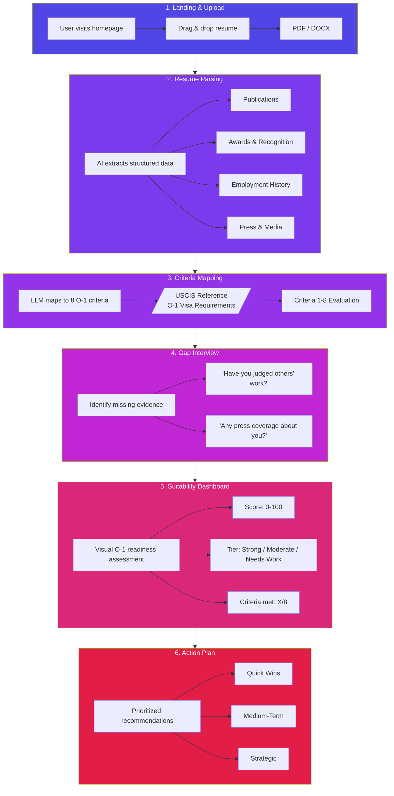
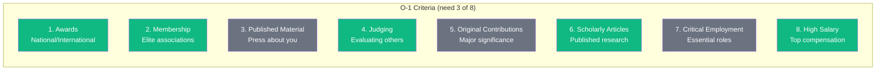
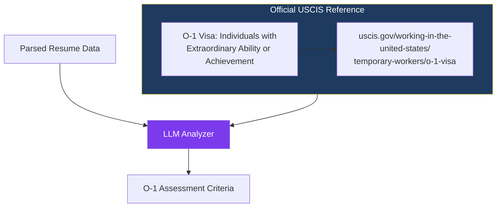
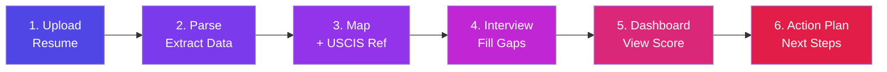

# O-1 Visa Readiness Analyzer - User Workflow

## Main User Flow

```mermaid
flowchart TD
    subgraph Step1["1. Landing & Upload"]
        A1[User visits homepage]
        A2[Drag & drop resume]
        A3[PDF / DOCX]
        A1 --> A2 --> A3
    end

    subgraph Step2["2. Resume Parsing"]
        B1[AI extracts structured data]
        B2[Publications]
        B3[Awards & Recognition]
        B4[Employment History]
        B5[Press & Media]
        B1 --> B2 & B3 & B4 & B5
    end

    subgraph Step3["3. Criteria Mapping"]
        C1[LLM maps to 8 O-1 criteria]
        C2[/"USCIS Reference<br/>O-1 Visa Requirements"/]
        C3[Criteria 1-8 Evaluation]
        C1 --> C2 --> C3
    end

    subgraph Step4["4. Gap Interview"]
        D1[Identify missing evidence]
        D2["'Have you judged others' work?'"]
        D3["'Any press coverage about you?'"]
        D1 --> D2 & D3
    end

    subgraph Step5["5. Suitability Dashboard"]
        E1[Visual O-1 readiness assessment]
        E2[Score: 0-100]
        E3[Tier: Strong / Moderate / Needs Work]
        E4[Criteria met: X/8]
        E1 --> E2 & E3 & E4
    end

    subgraph Step6["6. Action Plan"]
        F1[Prioritized recommendations]
        F2[Quick Wins]
        F3[Medium-Term]
        F4[Strategic]
        F1 --> F2 & F3 & F4
    end

    Step1 --> Step2 --> Step3 --> Step4 --> Step5 --> Step6

    style Step1 fill:#4f46e5,color:#fff
    style Step2 fill:#7c3aed,color:#fff
    style Step3 fill:#9333ea,color:#fff
    style Step4 fill:#c026d3,color:#fff
    style Step5 fill:#db2777,color:#fff
    style Step6 fill:#e11d48,color:#fff
```

## 8 O-1 Evidentiary Criteria

```mermaid
flowchart LR
    subgraph Criteria["O-1 Criteria (need 3 of 8)"]
        C1["1. Awards<br/>National/International"]
        C2["2. Membership<br/>Elite associations"]
        C3["3. Published Material<br/>Press about you"]
        C4["4. Judging<br/>Evaluating others"]
        C5["5. Original Contributions<br/>Major significance"]
        C6["6. Scholarly Articles<br/>Published research"]
        C7["7. Critical Employment<br/>Essential roles"]
        C8["8. High Salary<br/>Top compensation"]
    end

    style C1 fill:#10b981,color:#fff
    style C2 fill:#10b981,color:#fff
    style C3 fill:#6b7280,color:#fff
    style C4 fill:#10b981,color:#fff
    style C5 fill:#6b7280,color:#fff
    style C6 fill:#10b981,color:#fff
    style C7 fill:#6b7280,color:#fff
    style C8 fill:#10b981,color:#fff
```

## Technical API Flow

```mermaid
flowchart LR
    A["GET /<br/>Homepage"] --> B["POST /upload<br/>Resume Upload"]
    B --> C["GET/POST /interview/{id}<br/>Gap Questions"]
    C --> D["GET /results/{id}<br/>Dashboard & Plan"]

    style A fill:#22c55e,color:#fff
    style B fill:#eab308,color:#000
    style C fill:#3b82f6,color:#fff
    style D fill:#a855f7,color:#fff
```

## USCIS Integration

```mermaid
flowchart TD
    subgraph USCIS["Official USCIS Reference"]
        U1[O-1 Visa: Individuals with<br/>Extraordinary Ability or Achievement]
        U2[uscis.gov/working-in-the-united-states/<br/>temporary-workers/o-1-visa]
        U1 --> U2
    end

    Resume[Parsed Resume Data] --> Analyzer[LLM Analyzer]
    USCIS --> Analyzer
    Analyzer --> Assessment[O-1 Assessment Criteria]

    style USCIS fill:#1e3a5f,color:#fff
    style Analyzer fill:#7c3aed,color:#fff
```

## Simplified Linear Flow

```mermaid
flowchart LR
    Upload["1. Upload<br/>Resume"] --> Parse["2. Parse<br/>Extract Data"]
    Parse --> Map["3. Map<br/>+ USCIS Ref"]
    Map --> Interview["4. Interview<br/>Fill Gaps"]
    Interview --> Dashboard["5. Dashboard<br/>View Score"]
    Dashboard --> Plan["6. Action Plan<br/>Next Steps"]

    style Upload fill:#4f46e5,color:#fff
    style Parse fill:#7c3aed,color:#fff
    style Map fill:#9333ea,color:#fff
    style Interview fill:#c026d3,color:#fff
    style Dashboard fill:#db2777,color:#fff
    style Plan fill:#e11d48,color:#fff
```
